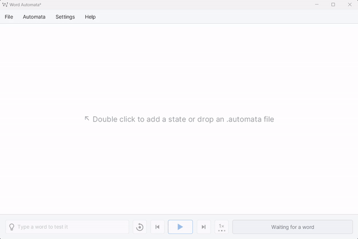
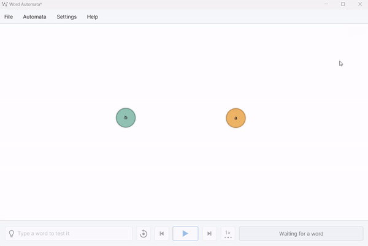
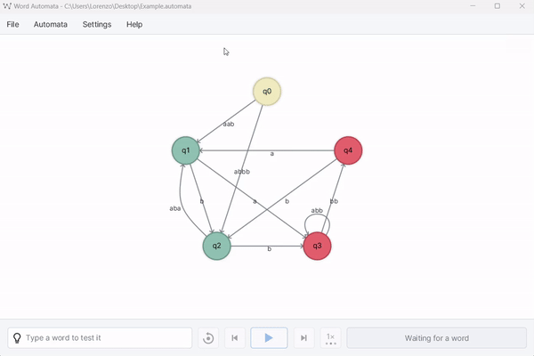
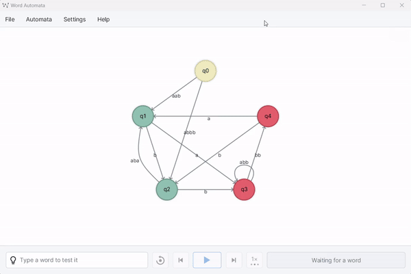
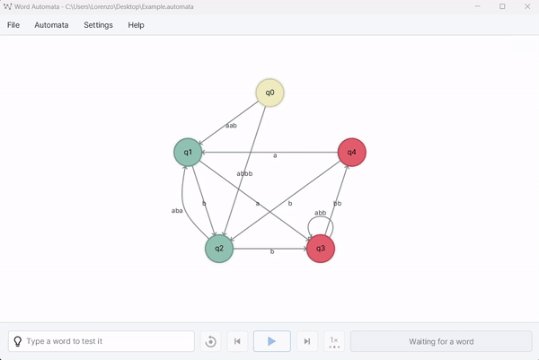

# Word Automata

> Final project for my Software Engineering course @ UniVR &mdash; A.Y. 2023/2024. A simple documentation (written in Italian) can be found [here](https://github.com/lorenzodbr/word-automata-doc). An English version of ``javadoc`` is also included in this repository. 

## Description

Word Automata is a graphical tool that allows you to create and simulate automata that recognize words. You can add states, transitions, and set the initial and final states. The tool will then allow you to simulate the automaton on a given word, showing you the path that the automaton takes.

## Installation

You only have to download the latest release from the [releases page](https://github.com/lorenzodbr/word-automata/releases/latest) and run the ``.jar`` file. Be sure to have (at least) Java 21 installed on your machine. 

You can also build the project yourself with Maven.

## Dependencies

The project uses the following dependencies:
- [``JavaFXSmartGraph``](https://github.com/brunomnsilva/JavaFXSmartGraph)
- [``AtlantaFX``](https://github.com/mkpaz/atlantafx)
- [``ikonli``](https://mvnrepository.com/artifact/org.kordamp.ikonli/ikonli-javafx)
- [``jna-platform``](https://mvnrepository.com/artifact/net.java.dev.jna/jna-platform)

## Usage

### Adding a state

> Note: you can choose if a state should be final on creation. You can also change this property later.

### Adding a transition

> Note: you can also add a new transition between two states by holding ``Ctrl``, ``Shift`` or ``Alt`` and dragging from the source to the target state.

### Setting the initial state

> Note: by default, the initial state is the first state you add. You can change it by right-clicking on a state and selecting "Set as initial state".

### Edit a state

> Note: in this section you can edit the state label and set it as final. You can also delete the state or add transitions bounded to it.

### Edit a transition

### Search for a word

> Note: this action will show the path that the automaton takes on the given word, highlighting the followed transitions.

### Additional features

- Since the project uses an adapted version of [JavaFXSmartGraph](https://github.com/brunomnsilva/JavaFXSmartGraph), automata graphs can be arranged automatically by toggling the ``Auto-position`` menu in ``Settings``.
- When timeline is playing, you can stop it and move it forward and backward by one transition at a time. You can also increase or decrease the animation speed. 
- You can save automata to file and open it later or on another machine.
- Actions can be performed with shortcuts. They are stated near their titles in the menu bar.
- You can enable dark mode globally (you may also argue: *why isn't it enabled by default?* and you would be probably right).
- If you need a hint on state colors' meaning, you can check them in ``Help > Legend``.

## License

This project is licensed under the GPL-3. You can find the full license [here](LICENSE).
